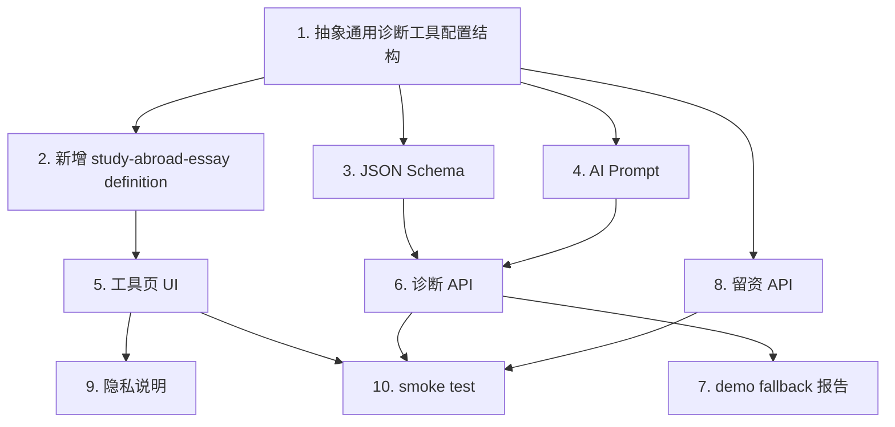

# 留学文书诊断工具复用改造方案

版本：v1.0
日期：2026-05-04
适用项目：北京全球博译官网诊断工具矩阵
参考原型：`diagnose-tools` 海外商务第一印象诊断工具
目标工具：留学文书诊断

## 1. 结论

“海外商务第一印象诊断工具”可以作为留学文书诊断的产品和工程参考，但不建议继续复制成另一个独立静态目录。

推荐策略是：

```text
复用现有诊断链路
-> 抽象成 Next.js 工具框架
-> 留学文书诊断作为一个独立 tool definition 接入
-> 后续签证材料清单、英文简历诊断、推荐信检查继续复用同一套框架
```

页面层面保持独立 URL 和独立 SEO，代码层面共用诊断框架、表单组件、结果组件、AI JSON 输出、留资组件和隐私组件。

## 2. 可复用资产

### 2.1 产品链路可复用

现有商务形象诊断已经验证了以下链路：

```text
用户输入信息
-> 点击生成基础诊断
-> 显示生成进度
-> 输出免费报告
-> 展示进阶报告或人工服务
-> 用户提交联系方式和材料
```

留学文书诊断可以沿用同一链路：

```text
选择申请场景
-> 粘贴文书
-> 显示隐私声明
-> 生成免费诊断
-> 展示评分、问题、证据和修改优先级
-> 引导文书润色、深度优化或材料包审核
-> 用户提交联系方式
```

### 2.2 工程模式可复用

现有工具中值得迁移的工程能力：

- AI 输出 JSON Schema 强约束。
- OpenAI Responses API 和 OpenAI-compatible chat completions 双路径。
- API 失败后 fallback 到本地 demo 报告。
- 诊断接口与留资接口分离。
- 生成进度条和前端状态管理。
- 基础 rate limit、origin 校验、安全响应头。
- 线索 JSONL 记录和邮件通知思路。

这些能力不应该只服务于商务形象诊断，应抽象为通用诊断工具能力。

## 3. 不应照搬的部分

### 3.1 不照搬图片上传

留学文书诊断第一版不建议支持 Word/PDF 上传，先做文本粘贴即可。

原因：

- 文档解析会引入额外错误。
- 用户粘贴文本最快。
- 文书隐私敏感，先减少文件保存和处理风险。
- 第一版重点验证诊断结果是否能转化咨询。

后续可以增加上传能力，但必须明确：

- 是否保存原文。
- 保存多久。
- 用户是否授权人工顾问查看。
- 是否允许删除。

### 3.2 不照搬视觉诊断 Prompt

商务形象诊断是视觉判断，留学文书诊断是文本、结构和申请匹配判断。Prompt 必须重写。

留学文书诊断不评价：

- 用户个人能力高低。
- 录取概率。
- 学校是否一定接受。
- 是否由 AI 生成。

应评价：

- 文书主题是否清楚。
- 结构是否完整。
- 经历是否有说服力。
- 目标项目匹配是否充分。
- 英文表达是否自然。
- 文本是否空泛、模板化、同质化。

### 3.3 不保存完整文书正文

默认策略：

```text
免费诊断阶段：不保存用户完整文书正文。
留资阶段：只保存联系方式、申请背景、诊断摘要和服务意向。
人工复核阶段：用户主动勾选授权后，才允许提交完整文书或材料包。
```

文书工具页必须明确展示隐私说明，避免用户担心文书被训练、查重系统收录或泄露。

## 4. 建议目录结构

长期建议纳入 Next.js App Router，不继续新增独立静态 app。

```text
app/tools/[toolSlug]/page.tsx
app/api/tools/[toolSlug]/diagnose/route.ts
app/api/tools/[toolSlug]/leads/route.ts

components/diagnose-tools/
  ToolPageLayout.tsx
  ToolStepRail.tsx
  ToolForm.tsx
  EssayTextInput.tsx
  DiagnosisProgress.tsx
  EssayDiagnosisResult.tsx
  ServiceCTA.tsx
  LeadCapture.tsx
  PrivacyNotice.tsx

lib/diagnose-tools/
  definitions.ts
  runDiagnosis.ts
  openai-json.ts
  sanitize.ts
  rate-limit.ts
  lead-store.ts

lib/diagnose-tools/definitions/
  study-abroad-essay.ts
  admission-translation-check.ts
  visa-document-checklist.ts
  english-cv-review.ts

lib/diagnose-tools/prompts/
  study-abroad-essay.ts

lib/diagnose-tools/schemas/
  study-abroad-essay.ts
```

第一阶段也可以先做一个工具页，但目录应按工具矩阵预留，避免后续每个工具重复造轮子。

### 4.1 公共导航与联系方式

诊断工具页虽然可以有独立产品 UI，但顶部导航、官网入口、报价入口和联系方式应尽量复用主站规则，避免每个静态工具单独维护一套不一致的导航。

工具页顶部至少保留：

- 官网 Logo，链接到 `/zh`。
- 主站导航入口。
- 获取报价入口。
- 咨询电话 `400-869-9562`，链接使用 `tel:400-869-9562`。

电话链接必须显式覆盖浏览器默认超链接样式，避免线上出现蓝色下划线：

```css
.tool-phone-link,
.tool-phone-link:visited,
.tool-phone-link:hover,
.tool-phone-link:focus-visible {
  color: var(--teal-dark);
  text-decoration: none;
}
```

如果工具仍使用静态 HTML/CSS 资产，更新样式后必须同步更新 CSS query version，例如：

```html
<link rel="stylesheet" href="/tools/example/styles.css?v=20260504-phone-nav" />
```

这样可以避免 Vercel 已更新但用户浏览器继续加载旧 CSS，导致电话链接显示为默认蓝色下划线。

## 5. 留学文书诊断页面流程

### 5.1 页面入口

页面 URL 建议：

```text
/tools/study-abroad-essay-check
```

页面标题：

```text
留学文书诊断 | PS / SOP 结构与申请匹配度检查
```

页面定位：

```text
免费检查你的 PS / SOP 是否存在主题不清、经历空泛、学校匹配不足、表达模板化等问题。
```

### 5.2 用户输入

第一屏不要放太多表单。建议采用两步式：

第一步：申请背景

- 申请阶段：本科 / 硕士 / 博士 / 转学 / 交换 / 奖学金
- 目标专业：自由输入或常用专业标签
- 文书类型：PS / SOP / Motivation Letter / Scholarship Essay / 不确定

第二步：文书正文

- 文书正文粘贴框。
- 字数提示。
- 隐私声明。
- 生成诊断按钮。

可选高级字段折叠展示：

- 目标国家或地区。
- 目标学校或项目。
- 当前文书状态：初稿 / 修改稿 / 已定稿 / 不确定。
- 用户最担心的问题：语言 / 结构 / 内容 / 匹配度 / 是否太模板。

### 5.3 输入校验

建议规则：

- 少于 150 英文词：提示“内容过短，只能做初步诊断”。
- 150-300 英文词：允许诊断，但标记为低置信度。
- 300-1500 英文词：正常诊断。
- 1500-2500 英文词：允许诊断，提示可能需要拆分。
- 超过 2500 英文词：建议拆分，第一版可以拒绝提交。

中文输入不直接拒绝，但结果中应提示：

```text
当前文本包含大量中文内容，本次诊断偏向结构和申请逻辑，不作为英文语言润色判断。
```

## 6. 诊断维度

免费版建议使用 6 个维度，每个维度 1-10 分，最终换算为 100 分。

| 维度 | 说明 | 高分标准 | 常见扣分 |
|---|---|---|---|
| 主题清晰度 | 是否明确表达申请动机、专业方向和未来目标 | 读完能清楚知道申请者要学什么、为什么学、下一步要做什么 | 开头空泛、目标模糊、只有兴趣没有动机 |
| 结构完整度 | 是否具备文书基本结构 | 开头、经历、能力、项目匹配、结尾互相承接 | 像流水账、段落跳跃、结尾仓促 |
| 申请匹配度 | 是否体现目标国家、学校、项目或专业匹配 | 有具体课程、研究方向、资源或项目特征 | 只说贵校优秀、没有具体匹配点 |
| 经历说服力 | 经历是否具体、有行动、有结果、有反思 | 能看到申请者做了什么、学到了什么、如何影响申请选择 | 经历罗列、缺少结果、缺少个人反思 |
| 语言表达 | 英文是否自然、准确、正式且适合申请场景 | 表达清晰、句式稳定、术语合适 | 中式英语、语法明显错误、表达生硬 |
| 文本同质化/空泛度风险 | 是否存在模板化、套话、缺乏细节的问题 | 有独特经历、具体细节、个人判断 | Ever since I was a child、I am passionate 等套话堆叠 |

注意：不要写“AI 生成检测”。统一使用“文本同质化/空泛度风险”。

## 7. JSON Schema 草案

AI 必须返回结构化 JSON。前端只渲染经过后端校验和清洗后的字段。

```json
{
  "overallScore": 72,
  "confidence": "normal",
  "diagnosisSummary": "这篇文书已有基本申请动机，但目标项目匹配和核心经历展开不足，更像个人经历介绍，不够像一篇有项目导向的 SOP。",
  "documentTypeAssessment": {
    "submittedType": "SOP",
    "detectedFit": "更接近 PS",
    "comment": "当前文本以个人经历为主，项目匹配内容较少。"
  },
  "dimensionScores": [
    {
      "id": "theme_clarity",
      "name": "主题清晰度",
      "score": 7,
      "comment": "申请方向基本明确，但缺少一个更具体的专业问题或长期目标来统领全文。"
    }
  ],
  "mainProblems": [
    {
      "title": "申请动机较泛",
      "severity": "high",
      "evidence": "I have always been interested in business and want to study at your university.",
      "whyItMatters": "这类表达无法说明申请动机的真实来源，也难以区分于其他申请者。",
      "suggestedFix": "补充一个具体经历，说明你为什么从泛泛兴趣转向明确专业选择。"
    }
  ],
  "revisionPriorities": [
    {
      "level": "high",
      "item": "重写申请动机段",
      "reason": "当前开头缺少具体触发点，无法承担全文主题。"
    }
  ],
  "quickWins": [
    "把第一段中泛泛表达替换为一个具体经历或问题。",
    "每段经历补充行动、结果和反思，而不是只描述职责。",
    "增加 1-2 个目标项目的具体匹配点。"
  ],
  "serviceRecommendation": {
    "primaryService": "文书深度优化",
    "secondaryService": "申请材料包审核",
    "reason": "当前问题主要集中在结构、动机和匹配度，不只是语法润色。"
  },
  "privacyNote": "本次诊断不代表录取概率判断，也不保存完整文书正文。"
}
```

### 7.1 字段约束

- `overallScore`：0-100 整数。
- `confidence`：`low` / `normal` / `high`。
- `dimensionScores`：必须正好 6 项。
- `mainProblems`：3-5 项。
- `quickWins`：3 项。
- `evidence`：必须来自用户原文，最长 240 字符。
- `suggestedFix`：只能给修改方向，不输出完整改写稿。
- `confidence`：只能是 `low` / `normal` / `high`。
- `mainProblems[].severity`：只能是 `high` / `medium` / `low`。
- `serviceRecommendation.primaryService` 和 `secondaryService`：必须使用 Schema enum 限定，不能让模型自由生成服务名称。

指定服务列表：

- 文书基础润色
- 文书深度优化
- SOP / PS 结构重写
- 英文简历优化
- 申请材料包审核

## 8. System Prompt v1 草案

```text
你是北京全球博译的留学申请文书诊断顾问。你的任务是基于用户提交的 PS、SOP、Motivation Letter 或奖学金文书，诊断其结构、申请匹配度、经历说服力和英文表达问题。

你不是招生官，不能承诺录取概率。你不是查重系统，不能判断文本是否由 AI 生成。你只能判断文本是否存在模板化、空泛、同质化、证据不足、结构不完整、项目匹配不足等问题。

请根据以下 6 个维度评分，每项 1-10 分：
1. 主题清晰度
2. 结构完整度
3. 申请匹配度
4. 经历说服力
5. 语言表达
6. 文本同质化/空泛度风险

诊断必须具体、可执行。mainProblems 中每个问题必须引用用户原文中的一句或一小段作为 evidence。不能编造用户没有写过的经历、学校、项目、成绩或成果。

免费诊断只提供问题定位、修改方向和少量局部建议。不要输出完整润色稿，不要逐段重写全文，不要替用户生成一篇完整文书。

如果文本过短、包含大量中文、缺少目标学校或专业信息，请降低 confidence，并在 diagnosisSummary 中说明诊断边界。

输出必须是简体中文 JSON，严格符合给定 schema，不要输出 Markdown、解释文字或额外字段。
```

实际开发时，应使用 Responses API 的 `json_schema` 严格模式；对 OpenAI-compatible 接口使用 `response_format: { "type": "json_object" }`，并在后端做字段校验和 fallback。

### 8.1 评分校准

每个维度采用 1-10 分，但不能让模型自然压缩到 6-8 分。Prompt 中必须加入评分锚点：

```text
1-3 分：该维度几乎空白或严重失败。例如 SOP 完全没有申请动机，或完全没有目标项目匹配。
4-5 分：有基础内容但明显不足。例如只用一句话提到目标学校，缺少课程、教授、项目资源或专业方向。
6-7 分：基本达标，但缺少深度、细节或个人反思。多数普通初稿会落在这个区间。
8-9 分：有明确亮点，经历、目标和项目匹配能互相支撑，超过多数申请者初稿水平。
10 分：极少给出，只在该维度几乎没有明显可改空间时使用。
```

综合评分应由 6 个维度加权计算，第一版可先等权平均后换算为 100 分。后续如数据足够，可把申请匹配度和经历说服力权重提高。

### 8.2 用户上下文注入

Prompt 必须显式注入用户选择的场景，不要只把文书正文丢给模型：

```text
用户申请阶段：{{applicationStage}}
目标专业：{{targetMajor}}
目标国家或地区：{{targetRegion}}
用户选择的文书类型：{{documentType}}
当前文书状态：{{draftStage}}
用户最担心的问题：{{userConcern}}

用户文书正文：
{{essayText}}
```

如果用户没有提供目标学校或项目，模型应降低申请匹配度诊断的置信度，并提示“缺少目标项目上下文，本次只能判断通用匹配表达是否充分”。

### 8.3 Few-shot 示例策略

第一版不需要长篇 few-shot，但建议放一个短示例，重点约束 `evidence` 和 `suggestedFix`：

```text
错误做法：suggestedFix 输出完整改写段落。
正确做法：suggestedFix 只说明如何修改，例如“补充一次具体经历，说明你为什么从泛泛兴趣转向该专业选择。”

错误做法：evidence 编造用户没有写过的句子。
正确做法：evidence 必须逐字摘自用户原文，长度不超过 240 字符。
```

## 9. 结果页模块

结果页建议从上到下展示：

1. 综合评分和诊断结论。
2. 6 个维度评分。
3. 文书类型判断：当前更像 PS 还是 SOP。
4. 主要问题：每个问题包含原文证据、影响、修改方向。
5. 修改优先级：高 / 中 / 低。
6. 3 条马上能改的建议。
7. 服务推荐。
8. Before / After 案例。
9. 留资表单。

### 9.1 免费结果边界

免费结果可以给：

- 评分。
- 问题定位。
- 原文证据。
- 修改方向。
- 局部示例。
- 服务推荐。

免费结果不应该给：

- 完整改写稿。
- 全文润色稿。
- 完整 SOP / PS 重写。
- 录取概率判断。
- AI 生成判断。

## 10. 转化路径

结果页 CTA 不要只有“联系我们”。建议按用户问题分流：

| 用户问题 | CTA 文案 | 对应服务 |
|---|---|---|
| 主要是语法和表达 | 我需要英文润色 | 文书基础润色 |
| 结构和动机有问题 | 我需要深度优化 | 文书深度优化 |
| 不确定 PS/SOP 怎么写 | 我需要结构重写 | SOP / PS 结构重写 |
| 同时有 CV、推荐信、成绩单 | 我需要材料包审核 | 申请材料包审核 |

留资表单字段：

- 联系方式：微信 / 邮箱 / 手机任选。
- 申请国家或地区。
- 申请阶段。
- 目标专业。
- 当前材料状态。
- 用户选择的服务。
- 是否授权顾问查看完整文书。

## 11. 隐私与信任文案

文书输入框下方建议放短文案：

```text
隐私说明：你的文书仅用于本次实时诊断。默认不保存完整正文，不用于 AI 训练，也不会提交到任何查重系统。若你希望顾问人工复核，需要在结果页主动授权并提交材料。
```

结果页底部再放一条：

```text
诊断结果仅用于发现文书结构、表达和申请匹配问题，不代表录取结果，也不构成学校官方意见。
```

## 12. MVP 范围

第一阶段只做：

- 单页留学文书诊断。
- 文本粘贴输入。
- 申请阶段、目标专业、文书类型三个核心字段。
- AI JSON 诊断。
- demo fallback。
- 结果页。
- 留资表单。
- 不保存完整文书正文。

暂不做：

- Word / PDF 上传。
- 多文档材料包上传。
- 用户账号系统。
- 支付。
- 自动生成完整润色稿。
- 录取概率评估。

## 13. 开发任务拆分

### 13.1 第一批任务

1. 抽象通用诊断工具配置结构。
2. 新增 `study-abroad-essay` tool definition。
3. 新增留学文书诊断 JSON Schema。
4. 新增 AI Prompt。
5. 新增工具页 UI。
6. 新增诊断 API。
7. 新增 demo fallback 报告。
8. 新增留资 API 或复用现有线索存储。
9. 增加隐私说明。
10. 本地 smoke test。

### 13.2 验收标准

- `/tools/study-abroad-essay-check` 可以打开。
- 不配置 API Key 时可以生成 demo 报告。
- 配置 API Key 时返回结构化 JSON 并正常渲染。
- AI 输出不包含完整改写稿。
- 结果中至少 3 个主要问题带原文证据。
- 结果页有明确服务推荐。
- 留资可以提交并记录。
- 前端不会保存完整文书到 localStorage。
- 后端默认不写入完整文书正文。
- 顶部咨询电话保留 `tel:400-869-9562` 可点击能力，但视觉上必须使用品牌色、无默认蓝色下划线；静态 CSS 更新后必须刷新版本号。

## 14. 与现有商务形象诊断的关系

商务形象诊断是第一个诊断工具 MVP，留学文书诊断应成为第一个文本类诊断工具。两者的共性是：

- 免费诊断获客。
- 结构化报告建立信任。
- 进阶服务完成转化。

差异是：

- 商务形象诊断处理图片，留学文书诊断处理文本。
- 商务形象诊断可展示参考图，留学文书诊断应展示问题证据和修改方向。
- 商务形象诊断可保存图片生成套餐，留学文书诊断默认不保存完整正文。

因此，复用重点应放在架构和链路，不是复制 UI 和 Prompt。

## 15. 迁移策略

当前现实不是完全从零开始。商务形象诊断已经存在两层实现：

- 静态前端资产：`public/tools/business-image/`。
- Next.js API Route：`app/api/business-image/[action]/route.ts`。
- Next.js 页面入口：`app/tools/business-image/page.tsx`，当前主要承担跳转到静态页的壳。

因此，留学文书诊断不要把商务形象诊断迁移作为前置任务。推荐两阶段策略：

### 15.1 第一阶段：新工具直接走 Next.js 框架

第一阶段只开发留学文书诊断：

```text
app/tools/study-abroad-essay-check/page.tsx
app/api/tools/study-abroad-essay-check/diagnose/route.ts
app/api/tools/study-abroad-essay-check/leads/route.ts
lib/diagnose-tools/*
```

商务形象诊断维持当前可运行状态，不拆、不重写、不阻塞新工具开发。

这样做的原因：

- 避免把已可运行的商务形象工具拆坏。
- 用留学文书诊断验证新的文本诊断框架。
- 等有第二个或第三个文本工具时，再判断抽象是否足够稳定。

### 15.2 第二阶段：可选迁移商务形象诊断

当留学文书诊断跑通后，再评估是否迁移商务形象诊断：

```text
先迁 AI JSON 调用、fallback、留资、通知等后端公共能力
再评估是否迁移静态前端
最后才考虑统一工具页 UI
```

商务形象诊断迁移不是第一阶段验收条件。第一阶段只要求不破坏现有商务形象诊断入口。

## 16. 后端输入校验与 token 预算

前端校验只是体验提示，后端必须做同样或更严格的限制。

### 16.1 后端硬限制

诊断 API 应执行：

- 文书正文为空：拒绝。
- 正文少于 500 字符：允许 demo 或低置信度诊断，但返回 `confidence = low`。
- 正文超过 15000 字符：拒绝，提示用户拆分文书。
- 粗略英文词数超过 2500：拒绝，提示用户拆分文书。
- 单 IP / 单会话频率限制：默认 60 秒内最多 10 次诊断请求。
- 请求超时：文本诊断建议 30-45 秒，不沿用图片生成的长超时。

### 16.2 confidence 判定

`confidence` 不完全交给模型。后端应先计算一个基础置信度，再与模型返回值取较低者。

建议规则：

| 条件 | 后端基础置信度 |
|---|---|
| 字符数 < 500 | low |
| 英文词数 < 300 | low |
| 中文字符占比 > 50% | low |
| 缺少申请阶段或目标专业 | low |
| 300-1500 英文词，且申请背景完整 | normal |
| 300-1500 英文词，且提供目标地区、阶段、专业、文书类型、用户担心问题 | high |

如果任一硬性低置信度条件命中，最终 `confidence` 不能高于 `low`。

### 16.3 token 预算

第一版应控制在：

```text
Prompt + 用户正文 + JSON 输出 <= 模型上下文窗口的安全范围
```

工程上可先用字符数粗估，不必第一版引入 tokenizer：

- 英文约 4 字符 = 1 token。
- 中文约 1-2 字符 = 1 token。
- 15000 字符作为第一版硬上限足够保守。

## 17. JSON Schema 强化

正式代码中的 Schema 应把 enum 写进去，而不是只写在文档里。

关键 enum：

```json
{
  "confidence": {
    "type": "string",
    "enum": ["low", "normal", "high"]
  },
  "severity": {
    "type": "string",
    "enum": ["high", "medium", "low"]
  },
  "primaryService": {
    "type": "string",
    "enum": [
      "文书基础润色",
      "文书深度优化",
      "SOP / PS 结构重写",
      "英文简历优化",
      "申请材料包审核"
    ]
  }
}
```

`documentTypeAssessment` 建议增加 `explanation` 字段，用于前端 tooltip 或说明：

```json
{
  "submittedType": "SOP",
  "detectedFit": "更接近 PS",
  "comment": "当前文本以个人经历为主，项目匹配内容较少。",
  "explanation": "PS 更强调个人经历与动机，SOP 更强调学术/职业目标与项目匹配。"
}
```

## 18. Demo fallback 报告策略

demo fallback 不能假装是 AI 对用户原文做出的真实诊断。它的定位是：

```text
接口不可用时保证产品链路可演示
不作为真实文书判断
不引用用户原文
明确标记为示例报告
```

### 18.1 demo 报告分层

建议按申请阶段准备模板：

- 本科申请示例。
- 硕士申请示例。
- 博士申请示例。
- 奖学金文书示例。

如果用户选择的阶段没有模板，使用通用 PS/SOP 初稿模板。

### 18.2 evidence 处理

demo 模式下不使用 `evidence` 假装引用用户原文。可以二选一：

1. 增加 `isDemo: true`，并把 `evidence` 写成“示例文本：...”。
2. 增加 `sampleEvidence` 字段，前端展示为“示例问题片段”。

第一版推荐方案 1，减少 schema 分支：

```json
{
  "isDemo": true,
  "mainProblems": [
    {
      "title": "申请动机较泛",
      "severity": "high",
      "evidence": "示例文本：I have always been interested in business...",
      "whyItMatters": "这类表达缺少个人背景和具体触发点。",
      "suggestedFix": "补充一个具体经历，说明兴趣如何转化为明确申请方向。"
    }
  ]
}
```

前端必须在 demo 报告顶部显示：

```text
当前为示例诊断报告：AI 接口暂不可用，此报告用于展示工具结果结构，不代表对你文书的真实判断。
```

## 19. 错误处理与降级策略

诊断 API 应统一返回可渲染的错误结构，不把模型错误直接暴露给用户。

| 错误类型 | 后端处理 | 前端提示 |
|---|---|---|
| 输入过短 | 返回低置信度或拒绝 | 文书内容过短，请补充完整段落后再诊断 |
| 输入过长 | 拒绝 | 文书过长，请拆分为单篇 PS/SOP 后提交 |
| AI 超时 | 返回 demo fallback | 当前接口繁忙，已展示示例报告 |
| JSON 不符合 Schema | 尝试一次修复或 fallback | 当前接口返回异常，已展示示例报告 |
| evidence 不在原文中 | 删除该问题或 fallback | 不直接提示用户 |
| 频率限制 | 拒绝 | 请求过快，请稍后再试 |

### 19.1 evidence 校验

后端应检查每个 `mainProblems[].evidence` 是否能在用户原文中找到。

如果找不到：

- 删除该问题；或
- 将 evidence 替换为“未能定位到可靠原文证据”，并降低 confidence；或
- 如果多数 evidence 都失败，直接 fallback。

第一版建议：如果 3 个以上 evidence 中少于 2 个能匹配原文，就 fallback 或返回低置信度。

## 20. 数据埋点与转化字段

MVP 不做复杂分析面板，但应预埋最小数据闭环。

### 20.1 诊断会话字段

诊断完成后生成 `diagnosticId`，前端在留资时带回：

```json
{
  "diagnosticId": "uuid",
  "toolSlug": "study-abroad-essay-check",
  "createdAt": "2026-05-04T00:00:00.000Z",
  "applicationStage": "硕士",
  "targetMajor": "Business Analytics",
  "documentType": "SOP",
  "overallScore": 72,
  "confidence": "normal",
  "primaryService": "文书深度优化",
  "selectedService": "文书深度优化",
  "leadSource": "diagnosis_result_cta"
}
```

默认不保存完整文书正文。可以保存脱敏摘要、评分、服务选择和用户授权状态。

### 20.2 核心指标

后续可以用这些字段计算：

- 诊断开始率。
- 诊断完成率。
- 结果页 CTA 点击率。
- 留资转化率。
- 服务分流占比。
- demo fallback 触发率。

第一版只需把必要字段写入 leads JSONL 或统一 leads store。

## 21. SEO 与流量入口

第一版页面应具备基础 SEO：

```text
title: 留学文书诊断 | PS / SOP 结构与申请匹配度检查
description: 免费检查 PS、SOP、Motivation Letter 是否存在主题不清、经历空泛、项目匹配不足和英文表达问题，并获取修改优先级建议。
canonical: /tools/study-abroad-essay-check
```

结构化数据建议使用 `WebApplication`：

```json
{
  "@context": "https://schema.org",
  "@type": "WebApplication",
  "name": "留学文书诊断",
  "applicationCategory": "EducationalApplication",
  "operatingSystem": "Web",
  "offers": {
    "@type": "Offer",
    "priceCurrency": "CNY",
    "price": "0"
  }
}
```

流量入口：

- 工具中心页 `/tools`。
- 留学文书润色服务页。
- SOP / PS 相关博客文章。
- 签证材料翻译和申请材料翻译页面的侧边 CTA。
- 小红书、知乎、公众号内容中的工具链接。

## 22. 开发任务依赖与估算

### 22.1 依赖关系



### 22.2 粗略估算

| 任务 | 规模 | 依赖 | 说明 |
|---|---:|---|---|
| 抽象通用诊断工具配置结构 | M | 无 | 不做过度抽象，只覆盖文本工具第一版需要 |
| 新增 tool definition | S | 配置结构 | 定义字段、SEO、CTA、服务枚举 |
| 新增 JSON Schema | S | 配置结构 | 包含 enum 和字段约束 |
| 新增 AI Prompt | M | Schema | 包含评分校准、上下文注入、短示例 |
| 工具页 UI | M | definition | 单页工具，移动端可用 |
| 诊断 API | M | Schema、Prompt | 包含输入校验、超时、fallback |
| demo fallback 报告 | S | API | 按申请阶段提供模板 |
| 留资 API | S | 配置结构 | 可复用或扩展现有线索存储 |
| 隐私说明 | S | UI | 输入区和结果页都要展示 |
| smoke test | S | UI、API、leads | 验证 demo 和真实 API 两条路径 |

### 22.3 第一版开发顺序

1. 先做 `lib/diagnose-tools` 最小公共层。
2. 再做 `study-abroad-essay` 配置、Schema 和 Prompt。
3. 然后做 API，先让 demo fallback 跑通。
4. 再做页面 UI 和结果渲染。
5. 最后接留资、隐私文案和 smoke test。

## 23. v1.1 开发前结论

补充以上策略后，本工具可以进入开发。第一阶段的工程原则是：

- 不迁移商务形象诊断作为前置任务。
- 不复制 `diagnose-tools` 独立目录。
- 不保存完整文书正文。
- 后端必须做输入限制和 Schema 校验。
- 先让 demo fallback 跑通，再接真实 AI。
- 抽象只服务当前 2-3 个确定工具，不为想象中的工具矩阵过度设计。
